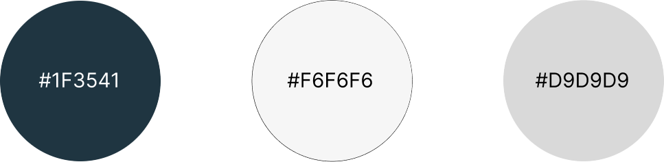
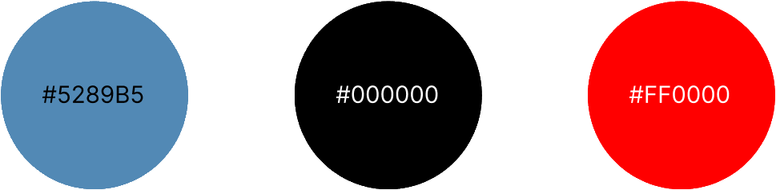

# Guia de estilo

## 1. Introdução
Se trata de um documento de registro das diretrizes de design para um produto.
Tem como principal objetivo ser uma fonte da verdade e para documentar todas as definições de design comuns a todos os projetos.

## 2. Logo

## 3. Estrutura dos templates
### 3.1 Tipografia
A principal família tipográfica definida para o projeto é a Montserrat e suas variações de estilo.

### 3.2 Cores
#### Primárias

#### Secundárias

### 3.3 Ícones

Os ícones usados na aplicação são os icones da biblioteca [material-icons](https://mui.com/pt/material-ui/material-icons/)

## 4. Referências Bibliográficas
> [1] Style Guide. Disponivel em: https://aelaschool.com/designvisual/style-guide-como-desenvolver-o-guia-de-estilo-da-sua-interface/
> [2] Material UI. Disponível em: https://mui.com/pt/material-ui

## 5. Histórico da revisão
|**Data**|**Descrição**|**Autor(es)**|
|--------|-------------|-------------|
| 20/07/2022 | Criação do documento | Igor, João Soares e Pedro Siqueira |
| 20/07/2022 | Adicionados topicos de cores e icones | João Soares, Lucas Meireles e Lucas Heler |
| 21/07/2022 | Adicionado logo | João Soares, Lucas Meireles e Lucas Heler |
| 16/12/2022 | Atualização de imagens, correções ortográficas e adição à nova wiki | Samuel Pereira |