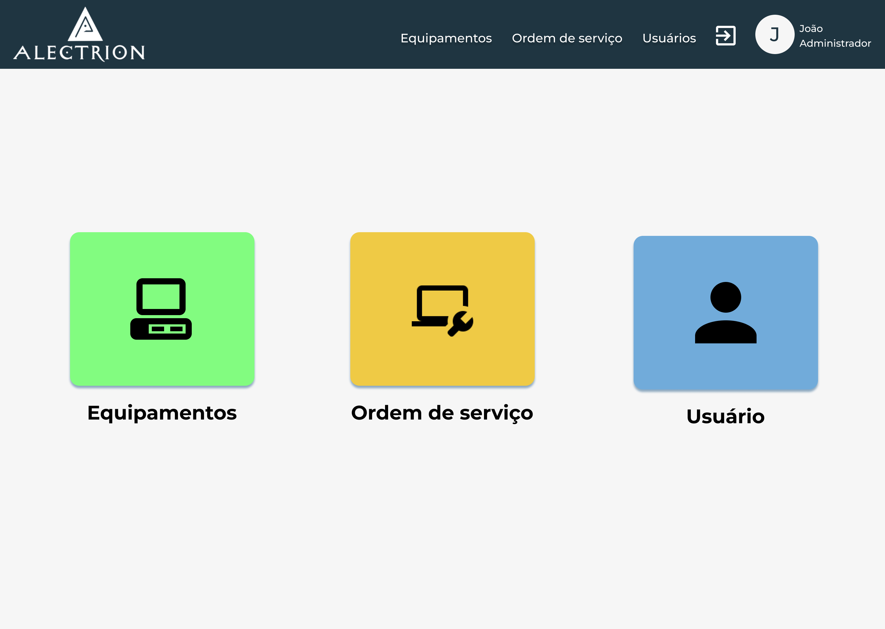

# Protótipo de alta fidelidade
## 1. Introdução
O protótipo de alta fidelidade tem como objetivo principal representar fielmente o produto, tanto em relação às funcionalidades quanto à estética e comportamento, apresentar detalhes das operações e suas extensões, como funcionalidades de botões e possíveis retornos de erros, conter as possíveis e diferentes etapas percorridas pelos usuários

## 2. Protótipo
O protótipo de alta fidelidade foi desenvolvido na ferramenta figma, apresentado e validado com o usuário. Abaixo está ilustrado algumas das principais telas do sistema.

### Tela Login:

### Tela de Tarefas:

### Tela de Ordens de Serviços abertas:

### Tela equipamento:

Todas as telas do protótipo estão disponíveis no [Figma](https://www.figma.com/file/UaUTq18rw4VxKExnPCp5N5/Alectrion-(Copy)?node-id=69%3A2&t=U9Kfc0F6JFjUJvuf-1).

## 3. Referência
> [1] Prototipagem de alta fidelidade: o que é, quando, por que e como usar? Disponível em: [https://www.digitalhouse.com/br/blog/prototipo-de-baixa-fidelidade/](https://medium.com/somos-tera/prototipagem-de-alta-fidelidade-635d745b662b)

## 4. Histórico da revisão
|**Data**|**Descrição**|**Autor(es)**|
|--------|-------------|-------------|
| 18/07/2022 | Criação do documento | João Pedro Soares, Lucas Alexandre, Moacir Mascarenha, Matheus de Cristo, Mário Vinícius, Wildemberg Junior e Lucas Heler |
| 16/12/2022 | Adição do documento à nova wiki e pequenos ajustes | Samuel Pereira |