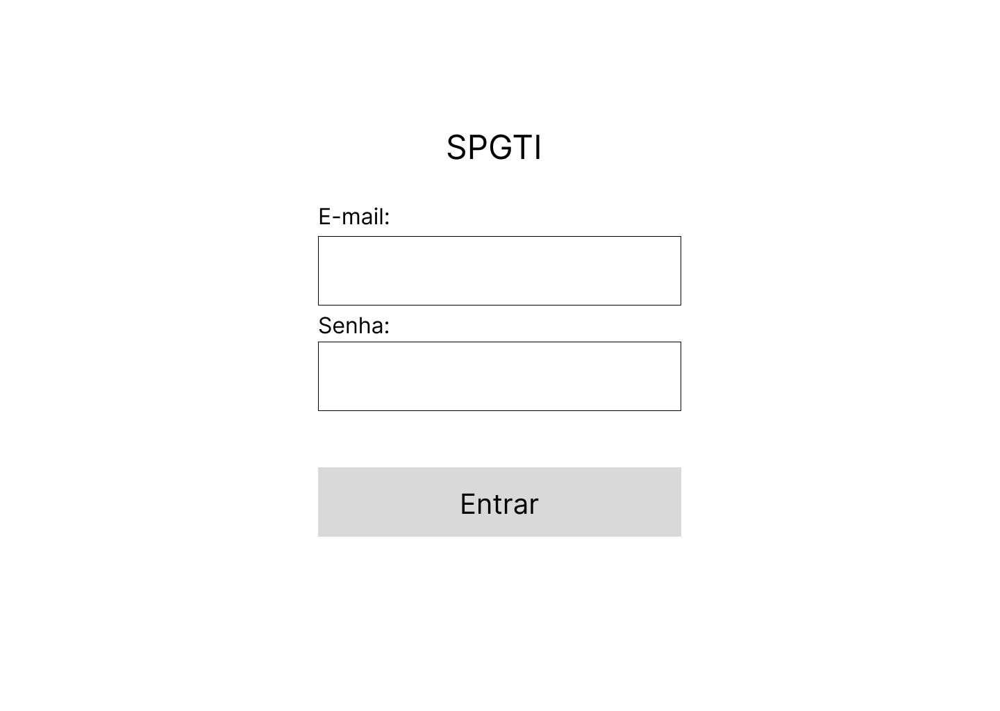
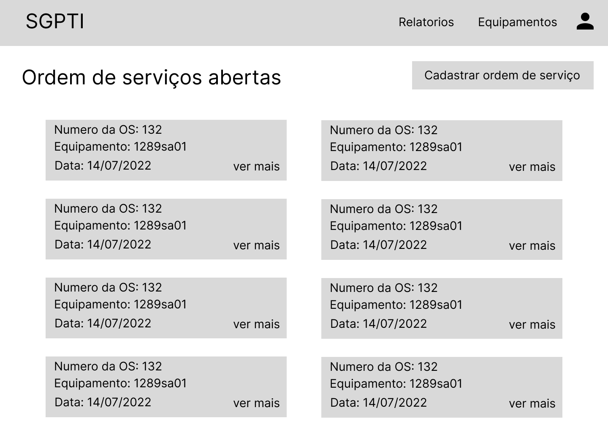
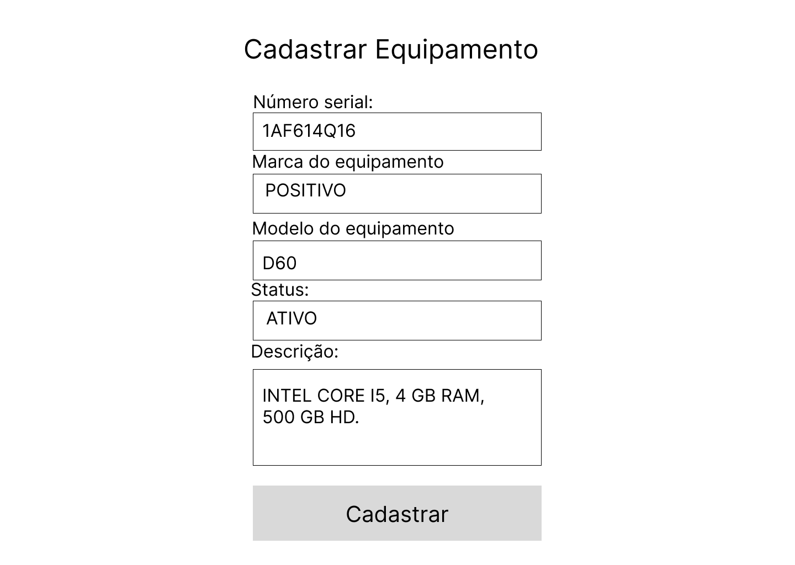

# Protótipo baixa fidelidade
## 1. Introdução
O protótipo de baixa fidelidade tem como principal objetivo validar um fluxo de trabalho que o usuário terá que realizar, focando mais nas funcionalidades e/ou na arquitetura sem se preocupar com detalhes de design. 
 
Este protótipo tem o intuito de obter um feedback do usuário de forma mais rápida.

## 2. Protótipo
O protótipo de baixa fidelidade foi desenvolvido na ferramenta Figma, apresentado e validado com o usuário. Abaixo está ilustrado algumas das principais telas do sistema.

### Tela Login:

### Tela de Ordens de Serviços abertas:

### Tela cadastrar equipamento:

Todas as telas do protótipo estão disponíveis no [Figma](https://www.figma.com/file/UaUTq18rw4VxKExnPCp5N5/Alectrion-(Copy)?node-id=0%3A1&t=U9Kfc0F6JFjUJvuf-1).

## 3. Referência
> [1] Protótipo de baixa fidelidade: o que é e como desenvolver em um projeto? Disponível em: https://www.digitalhouse.com/br/blog/prototipo-de-baixa-fidelidade/

## 4. Histórico da revisão

|**Data**|**Descrição**|**Autor(es)**|
|--------|-------------|-------------|
| 18/07/2022 | Criação do documento | Andrew Lugon,João Pedro Soares, Lucas Alexandre e Mário Vinícius |
| 16/12/2022 | Adição do documento à nova wiki e pequenos ajustes | Samuel Pereira |