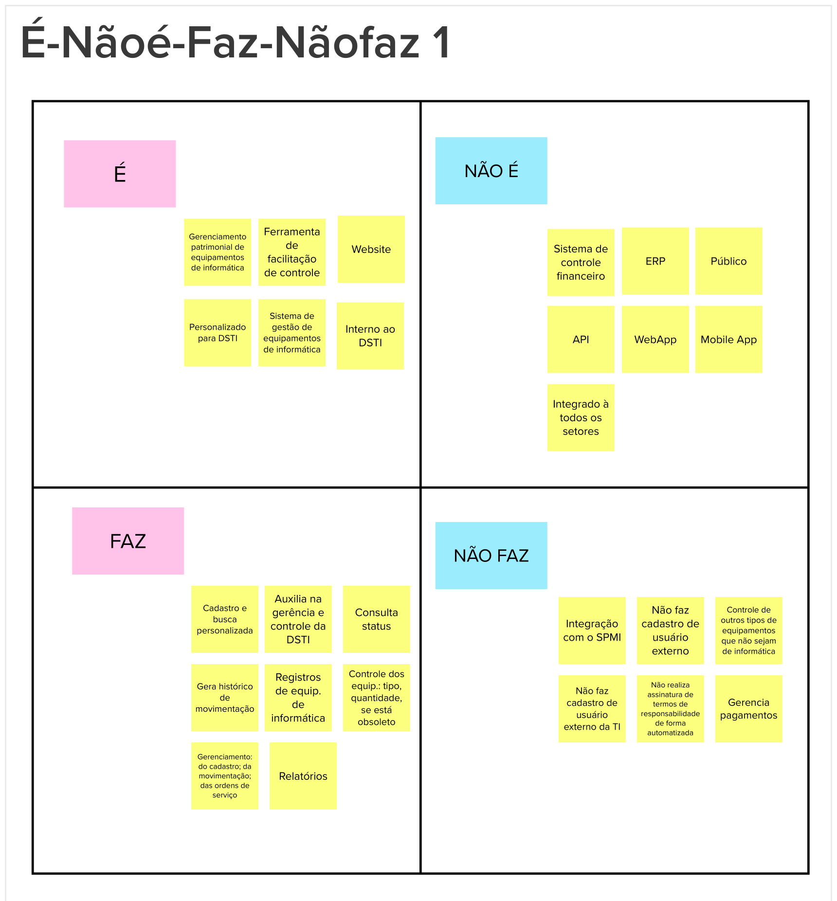

# O Produto É, Não é, Faz, Não faz

## 1. Introdução
Esta etapa consiste em classificar o produto em quatro diretrizes, esclarecendo aspectos sobre o produto ser ou fazer algo.
 
Esta atividade ajuda a esclarecer o produto, ajudando os participantes a chegar em uma visão mais alinhada sobre o que produto faz, quanto sobre o que o produto não faz.

## 2. Resultado

## 3. Referências Bibliográficas

> [1] CAROLI, Paulo. Lean Inception: Como alinhar as pessoas e construir o produto certo. 1. ed. atual. São Paulo: Caroli, 2018. ISBN 978-85-94377-06-7. E-book.

## 4. Histórico de versão

|**Data**|**Descrição**|**Autore(es)**|
|--------|-------------|--------------|
|29/11/2022| Adição do documento à wiki | Samuel Pereira |
