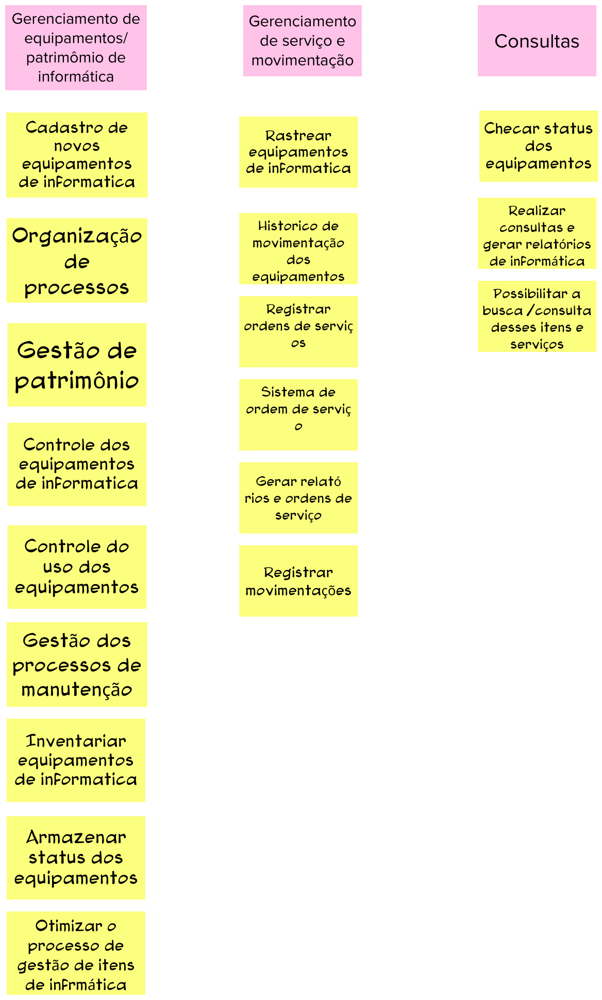

# Objetivos do Produto

## 1. Introdução
Esta etapa consiste em cada participante compartilhar o que entende como objetivo para o negócio. 
 
Esta atividade auxilia no levantamento e esclarecimentos dos objetivos, ficando nítido à equipe qual o foco do projeto.

## 2. Resultado

## 3. Referências Bibliográficas

> [1] CAROLI, Paulo. Lean Inception: Como alinhar as pessoas e construir o produto certo. 1. ed. atual. São Paulo: Caroli, 2018. ISBN 978-85-94377-06-7. E-book.

## 4. Histórico de versão

|**Data**|**Descrição**|**Autore(es)**|
|--------|-------------|--------------|
|29/11/2022| Adição do documento à wiki | Samuel Pereira |
