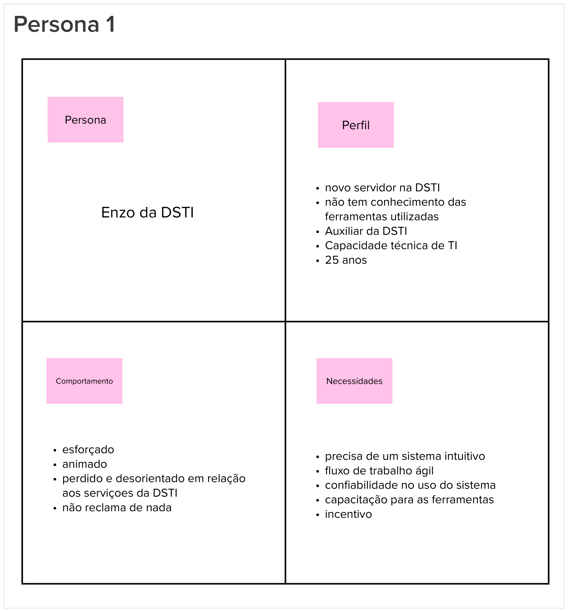
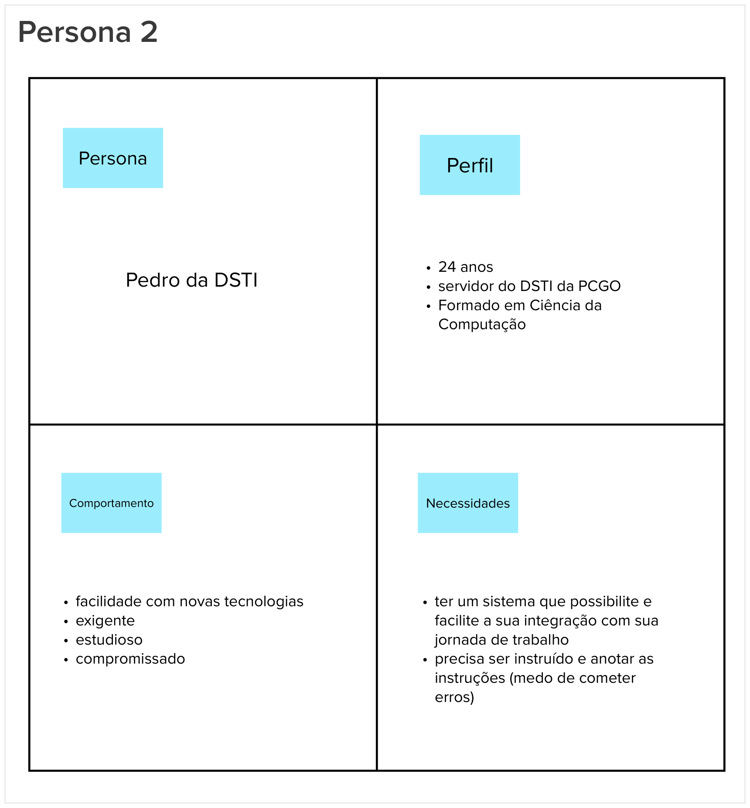
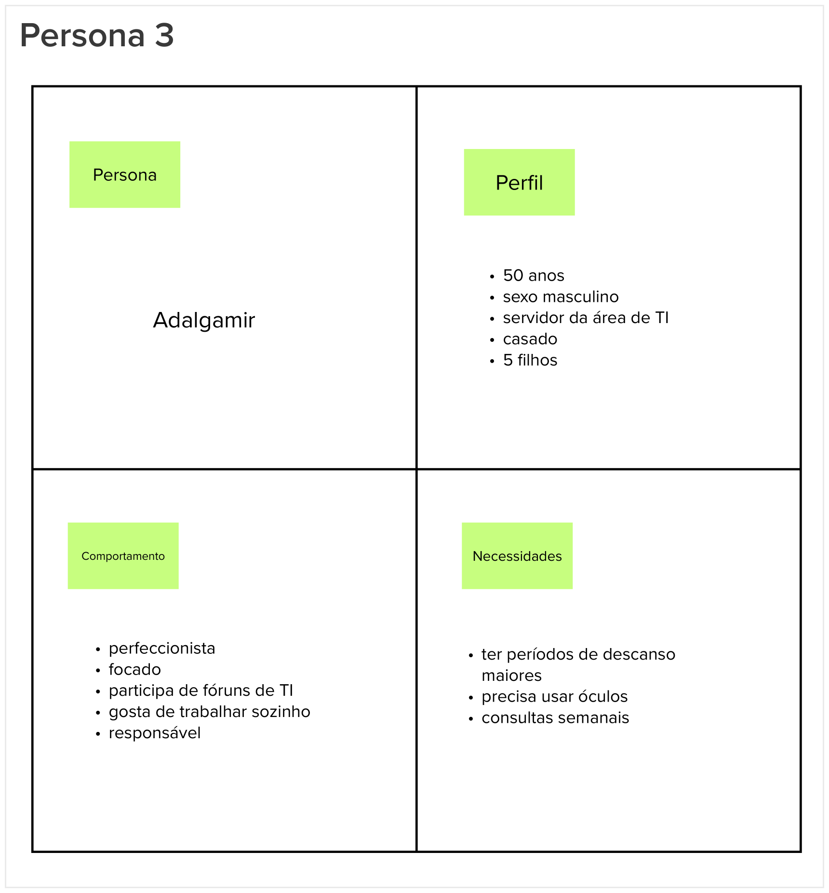

# Personas

## 1. Introdução
Esta etapa consiste na criação de personas, visando auxilizar na identificação de funcionalidades do ponto de vista dos usuários acerca produto e seus objetivos.
 
Uma persona representa um usuário do produto ou serviço, descrevendo seu papel como também suas necessidades, criando uma representação realista dos usuários a qual auxilia o time a descrever funcionalidades do ponto de vista de quem interagirá com o produto final.

## 2. Resultado

## 3. Referências Bibliográficas

> [1] CAROLI, Paulo. Lean Inception: Como alinhar as pessoas e construir o produto certo. 1. ed. atual. São Paulo: Caroli, 2018. ISBN 978-85-94377-06-7. E-book.

## 4. Histórico de versão

|**Data**|**Descrição**|**Autore(es)**|
|--------|-------------|--------------|
|29/11/2022| Adição do documento à wiki | Samuel Pereira |
