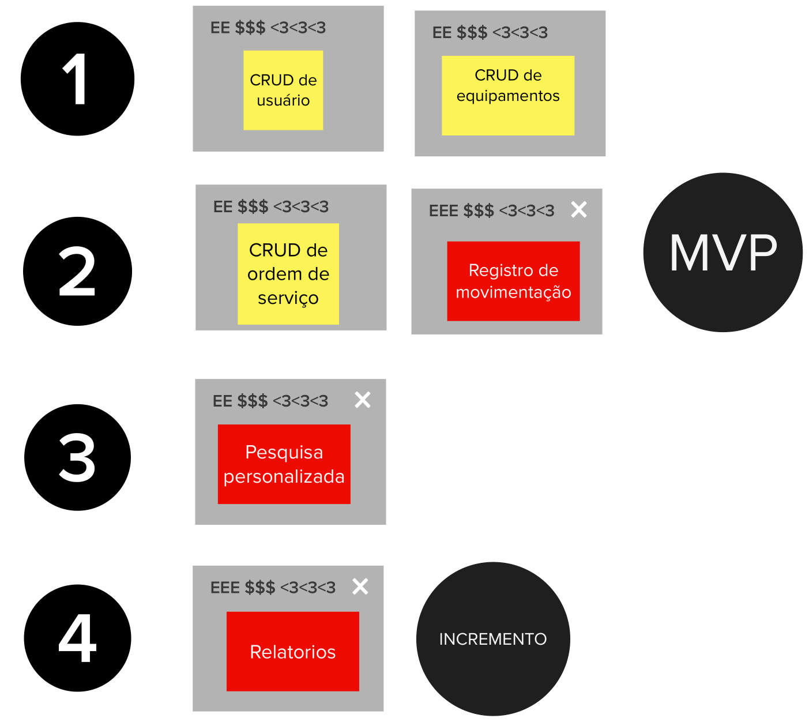

# Sequenciador

## 1. Introdução
Esta etapa consiste na construção do sequenciador de funcionalidades. O propósito do sequenciador de funcionalidades é mostrar a ordem mais adequada para o desenvolvimento das funcionalidades, definir o MVP e os seus incrementos.
 
Após a definição das ondas, seguindo as regras do sequenciador, o MVP é escolhido através da identificação da combinação de funcionalidades que atingem uma versão mínima do produto capaz de validar uma hipótese do negócio.

## 2. Resultado

## 3. Referências Bibliográficas

> [1] CAROLI, Paulo. Lean Inception: Como alinhar as pessoas e construir o produto certo. 1. ed. atual. São Paulo: Caroli, 2018. ISBN 978-85-94377-06-7. E-book.

## 4. Histórico de versão

|**Data**|**Descrição**|**Autore(es)**|
|--------|-------------|--------------|
|30/11/2022| Adição do documento à wiki | Samuel Pereira |
