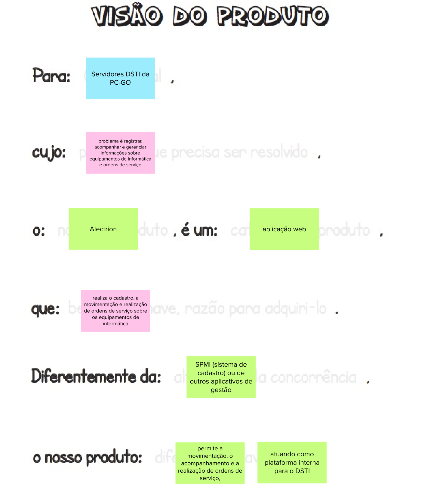

# Visão do produto

## 1. Introdução
Esta etapa consiste na definição da visão do produto de forma colaborativa. A definição da visão do produto é essencial, tendo o intuito de ajudar a trilhar o caminho inicial, definindo a essência do valor de negócio do produto.
 
A visão do produto segue o seguinte template:
- Para: [cliente final]
- cujo: [problema que precisar ser resolvido]
- O: [nome do produto]
- é um: [categoria do produto]
- que: [benefício-chave, razão para adquiri-lo]
- diferentemente do: [alternativa da concorrência]
- O nosso produto: [diferença-chave]

É importante todos os envolvidos trabalharem em conjunto para formar uma frase homogênea ao fim da atividade.

## 2. Resultado

## 3. Referências Bibliográficas

> [1] CAROLI, Paulo. Lean Inception: Como alinhar as pessoas e construir o produto certo. 1. ed. atual. São Paulo: Caroli, 2018. ISBN 978-85-94377-06-7. E-book.

## 4. Histórico de versão

|**Data**|**Descrição**|**Autore(es)**|
|--------|-------------|--------------|
|28/11/2022| Adição do documento à wiki | Samuel Pereira |
