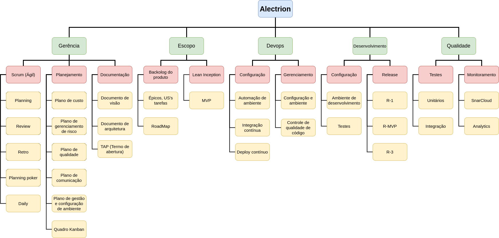

# Estrutura Analítica do Projeto (EAP)

## 1. Introdução

Conforme descrito no Guia PMBOK, a EAP pode ser compreendida como uma decomposição do escopo total do trabalho a ser realizado pela equipe do projeto visando alcançar os objetivos do projeto e realizar entregas requisitadas. Desta forma, a EAP organiza e define o escopo total do projeto aprovado.

Na EAP o trabalho planejado é contido no nível mais baixo de componente, denominados pacotes de trabalho. Um pacote de trabalho pode ser usado para agrupar as atividades onde o trabalho é agendado, estimado, monitorado e controlado. No contexto da EAP, o trabalho se refere às entregas que são resultados da atividade.

## 2. EAP

## 3. Referências Bibliográficas

<!-- Referências enumeradas-->

> [1] Guia PMBOK 6a. ed. EUA: Project Management Institure, 2017. Disponível em: https://www.site.com

## 4. Histórico de versão

|**Data**|**Descrição**|**Autore(es)**|
|--------|-------------|--------------|
|27/11/2022| Criação do documento | João Vitor |