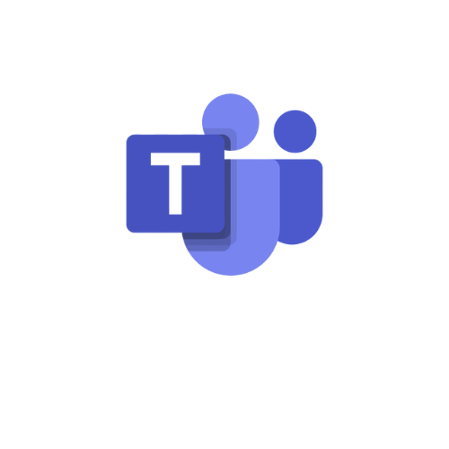

# Planejamento da comunicação externa e interna

<!-- Tópicos e subtópicos com numeração-->

## 1. Introdução
Este documento possui a finalidade de elucidar como foi organizada e estruturada a comunicação entre a equipe de gerência (EPS) e desenvolvimento (MDS), os product owners da DSTI, e o professor Hilmer, responsável pelo projeto.

## 2. Ferramentas para comunicação

Utilizaremos as seguintes ferramentas conforme a finalidade de cada uma:

|**Logo**|**Nome**|**Finalidade**|
|--------|-------------|---------|
||Discord|Comunicação rápida entre a equipe e product owner|
||Microsoft Teams|Reuniões internas da equipe e reuniões com o product owner|
||Telegram|Comunicação rápida e de acesso fácil usada pela equipe|
||Google Drive|Gerenciamento de arquivos, como planilhas e outros documentos|
||Github|Repositório com os documentos, arquivos, códigos, dentre outros recursos relacionados ao projeto|
||ZenHub| Acompanhamento e gerenciamento do projeto|

## 3. Comunicação Interna

Comunicação interna é referente à equipe de gerência (EPS) e desenvolvedores (MDS) envolvidos diretamente com o projeto.

|**Objetivo**|**Envolvidos**|**Frequência**|**Dia e Horário**|**Meio**|**Ferramenta**(ou local)|
|------------|--------------|--------------|-----------|--------|--------|
|Planejamento, revisão e retorspectiva de sprints| EPS e MDS| A cada 2 semanas | Sábado, das 14:00 ás 16:30h| Remoto|Teams|
|Acompanhamento da execução de tarefas| EPS e MDS| De segunda a sexta-feira, exceto terça e quinta-feiras| Seg, Qua, Sex, ás 11:50h| Remoto|Telegram (1)|
|Integração da equipe e esclarecimentos gerais| EPS e MDS|Toda terça e quinta-feiras| Ter e Qui, das 15:50 ás 16:00h|Presencial|Ao lado da sala i8, na FGA|

**OBS**: Reuniões com o product owner e acompanhamentos, podem ser realizados sob demanda.

(1) Essa atividade será feita via envio de mensagens na plataforma em questão. O conteúdo da mensagem enviada por cada membro deverá responder aos seguintes pontos: i) O que estou fazendo hoje?; ii) O que pretendo fazer amanhã?; iii) Estou tendo dificuldades? Se sim, quais?.

## 4. Comunicação Externa

Comunicação externa é referente à equipe (EPS e MDS) e outros interessados.

|**Objetivo**|**Envolvidos**|**Frequencia**|**Dia e Horário**|**Meio**|**Ferramenta**(ou local)|
|------------|--------------|--------------|-----------|--------|--------|
|Reunião com o product owner| EPS, MDS, DSTI, prof. Hilmer| Semanal| Segunda-feira, de 17:00 ás 18:00h| Remoto|Teams|

**OBS**: Outras reuniões podem ser realizados sob demanda.

## 5. Referências

<!-- Referências enumeradas-->

> [1] EQUIPE ALECTRION 2022-1. Plano de Comunicação. Disponível em: https://fga-eps-mds.github.io/2022-1-Alectrion-DOC/documentation/Documentos/PlanoComunicacao.html#plano-de-comunica%C3%A7%C3%A3o

## 6. Histórico de versão

|**Data**|**Descrição**|**Autore(es)**|
|--------|-------------|--------------|
|29/11/2022| Criação do plano de comunicação | Erick Giffoni |
