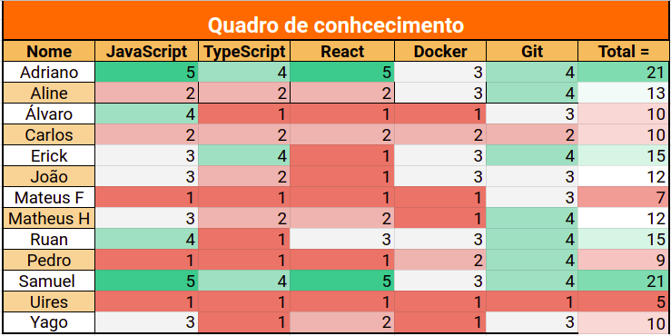

# Sprint 1

## 1. Visão Geral

* Data de início: 27/11/2022
* Data de término: 10/12/2022

## 2. Objetivo 

Realizar as histórias de usuários relacionadas ao épico ao cadastro de usuário e elaborar as demais entregas relacionadas a primeira release (R1).

## 3. Backlog da Sprint

|Tarefa|Responsável(is)|
|------|-----------|
| [US 01](https://github.com/fga-eps-mds/2022-2-alectrion-doc/issues/7): Cadastro de usuário | Matheus Henrique e Pedro |
| [US 02](https://github.com/fga-eps-mds/2022-2-alectrion-doc/issues/8): Sessão de usuário | Matheus Henrique e Pedro |
| [US 03](https://github.com/fga-eps-mds/2022-2-alectrion-doc/issues/9): Visualizar perfil de usuário | Mateus Fidelis e Yago |
| [US 04](https://github.com/fga-eps-mds/2022-2-alectrion-doc/issues/10): Recuperar minha senha | Adriano, Carlos e Uires |
| [US 05](https://github.com/fga-eps-mds/2022-2-Alectrion-DOC/issues/12): Administração de usuários | Adriano, Carlos e Uires |
| [US 06](https://github.com/fga-eps-mds/2022-2-Alectrion-DOC/issues/13): Registro de equipamentos | Mateus Fidelis e Yago |

## 4. Quadro de conhecimento

## 5. Reunião

|Turma|Nome|Presença|
|-----|----|--------|
| EPS | Aline Helena Lermen | Presente |
| EPS | Álvaro Leles Guimarães | Presente |
| EPS | Antonio Ruan Moura Barreto | Presente |
| EPS | Erick Giffoni | Presente |
| EPS | João Vitor Lopes de Farias | Presente |
| EPS | Samuel de Souza Buters Pereira | Presente |
| MDS | Adriano Fonseca | Presente |
| MDS | Carlos Eduardo Mendes de Mesquita | Ausente |
| MDS | Mateus Fidelis Marinho Maia | Ausente |
| MDS | Matheus Henrique dos Santos | Presente |
| MDS | Pedro José DIas de Oliveira Campos | Presente |
| MDS | Uires Carlos | Presente |
| MDS | Yago Amin Santos | Ausente |

## 6. Histórico de versão

|**Data**|**Descrição**|**Autore(es)**|
|--------|-------------|--------------|
|27/11/2022| Criação do documento | João Vitor |