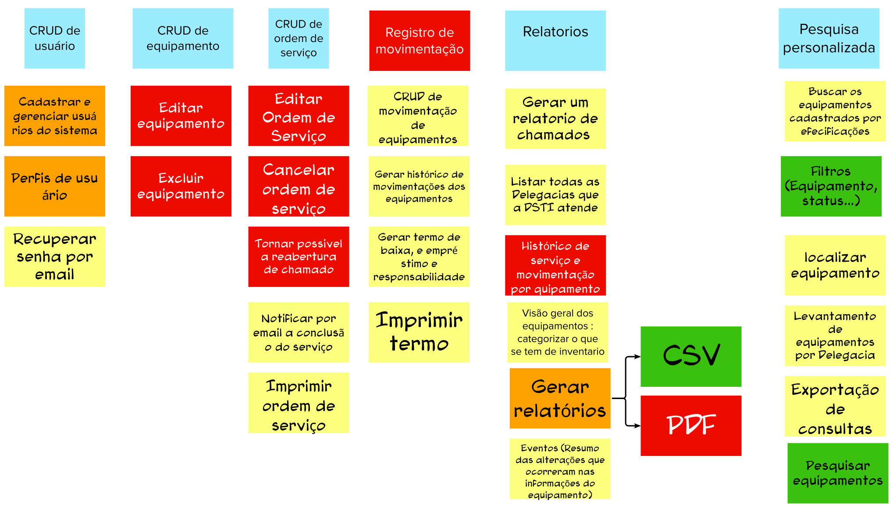

# Brainstorm de funcionalidades

## 1. Introdução
Esta etapa consiste no levantamento das funcionalidades através do brainstorming. Uma funcionalidade é a descrição de uma ação ou interação de um usuário com o produto, devendo ser o mais simples possível.
 
As seguintes perguntas ajudam com a descoberta de funcionalidades:

> O que deve ter no produto para atender as necessidades da persona?
>
> Quais funcionalidades devemos construir para atingir esse objetivo de produto?

Através dessas perguntas, é possível notar que o brainstorm de funcionalidades depende dos artefatos da lista de objetivos e personas, os quais devem ter sido feitos anteriormente.

## 2. Resultado

## 3. Referências Bibliográficas

> [1] CAROLI, Paulo. Lean Inception: Como alinhar as pessoas e construir o produto certo. 1. ed. atual. São Paulo: Caroli, 2018. ISBN 978-85-94377-06-7. E-book.

## 4. Histórico de versão

|**Data**|**Descrição**|**Autore(es)**|
|--------|-------------|--------------|
|29/11/2022| Adição do documento à wiki | Samuel Pereira |
