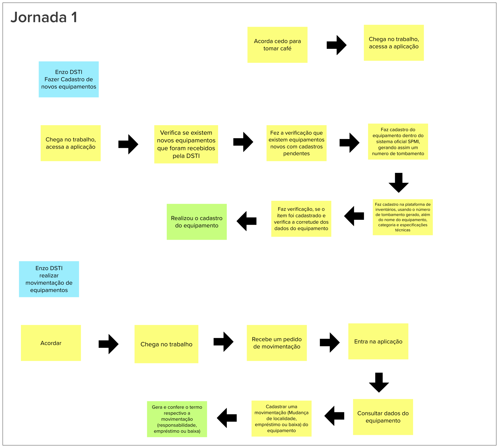
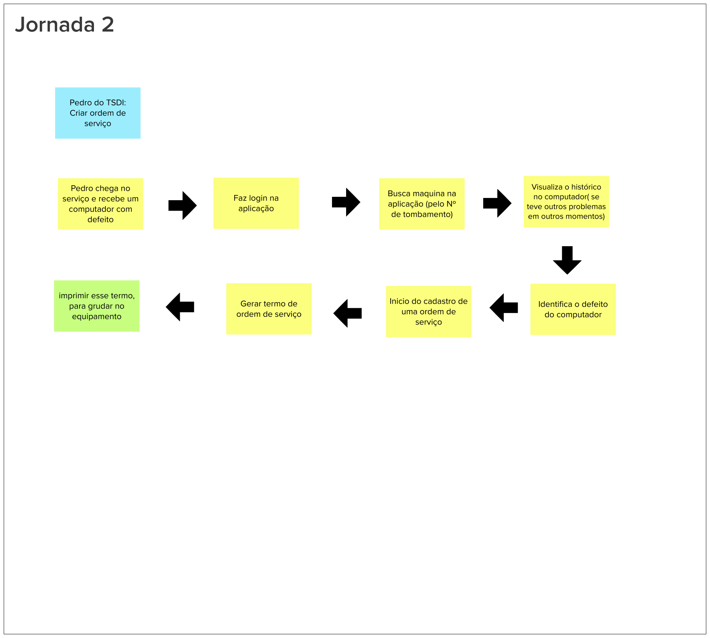
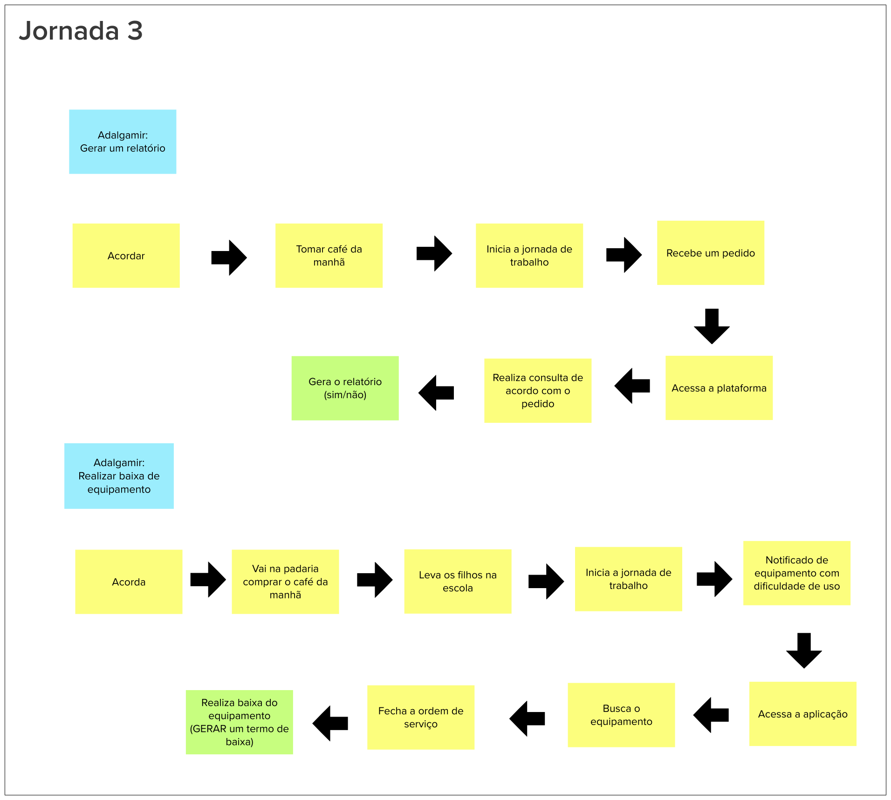

# Jornadas do usuário
Esta etapa consiste na descrição de jornadas das personas previamente levantadas. Jornadas descrevem o percurso de um usuário por uma sequência de passos dados para alcançar um objetivo.
 
Através desta atividade, a equipe levantará questões e opiniões sobre os desejos do usuário e as funcionalidades do produto.

## 2. Resultado

## 3. Referências Bibliográficas

> [1] CAROLI, Paulo. Lean Inception: Como alinhar as pessoas e construir o produto certo. 1. ed. atual. São Paulo: Caroli, 2018. ISBN 978-85-94377-06-7. E-book.

## 4. Histórico de versão

|**Data**|**Descrição**|**Autore(es)**|
|--------|-------------|--------------|
|29/11/2022| Adição do documento à wiki | Samuel Pereira |
