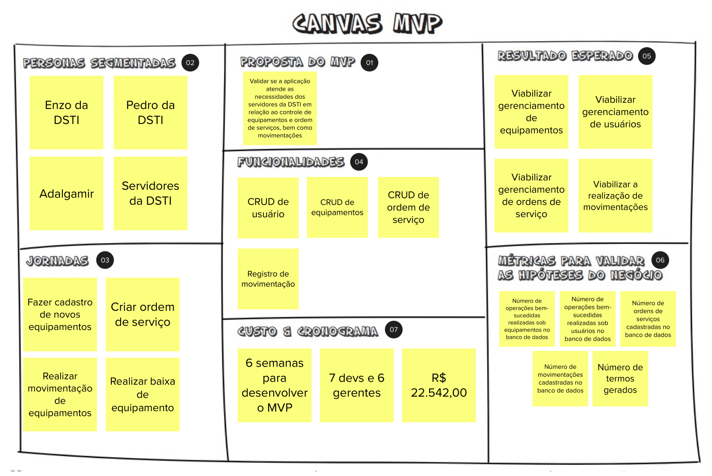

# Canvas MVP

## 1. Introdução
Esta etapa consiste no detalhamento do MVP e as suas funcionalidades. O canvas MVP é um quadro visual que auxilia a equipe a alinhar e definir a estratégia do MVP: a versão mais simples do produto a qual pode ser disponibilizada para o negócio e que possa ser efetivamente utilizada e validada pelos usuários finais.

## 2. Resultado

## 3. Referências Bibliográficas

> [1] CAROLI, Paulo. Lean Inception: Como alinhar as pessoas e construir o produto certo. 1. ed. atual. São Paulo: Caroli, 2018. ISBN 978-85-94377-06-7. E-book.

## 4. Histórico de versão

|**Data**|**Descrição**|**Autore(es)**|
|--------|-------------|--------------|
|30/11/2022| Adição do documento à wiki | Samuel Pereira |
