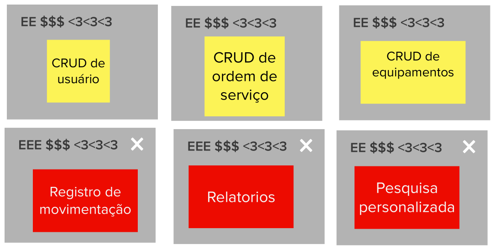

# Revisão técnica, de negócio e de UX

## 1. Introdução
Esta etapa consiste na avaliação de cada funcionalidade levantada na atividade de brainstorm de funcionalidades. As funcionalidades são avaliadas em termos de esforço, valor para o negócio, experiência dos usuários e confiança que temos sobre o que e como construí-la.

## 2. Resultado

## 3. Referências Bibliográficas

> [1] CAROLI, Paulo. Lean Inception: Como alinhar as pessoas e construir o produto certo. 1. ed. atual. São Paulo: Caroli, 2018. ISBN 978-85-94377-06-7. E-book.

## 4. Histórico de versão

|**Data**|**Descrição**|**Autore(es)**|
|--------|-------------|--------------|
|30/11/2022| Adição do documento à wiki | Samuel Pereira |
